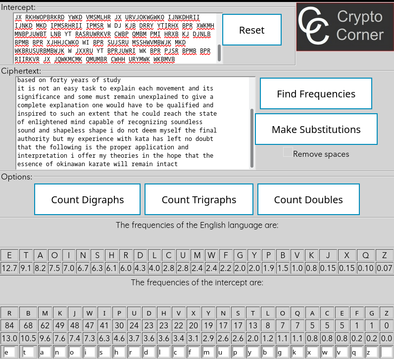

# Exercises

## 1

#### 1.1

[python script](./letter_frequency.py)

#### 1.2

The text found is:

```
because the practice of the basic movements of kata is
the focus and mastery of self is the essence of
matsubayashi ryu karate do i shall try to elucidate the
movements of the kata according to my interpretation
based on forty years of study

it is not an easy task to explain each movement and its
significance and some must remain unexplained to give a
complete explanation one would have to be qualified and
inspired to such an extent that he could reach the state
of enlightened mind capable of recognizing soundless
sound and shapeless shape i do not deem myself the final
authority but my experience with kata has left no doubt
that the following is the proper application and
interpretation i offer my theories in the hope that the
essence of okinawan karate will remain intact
```

Using this [website](https://crypto.interactive-maths.com/frequency-analysis-breaking-the-code.html)



#### 1.3

Shoshin Nagamine wrote it.

## 2

#### 2.1

[Brute force](./shift_text.py)

#### 2.2

Tecumseh wrote it.

## 3

#### 3.1

Information:

```
Budget: 1 million
ASIC: 5.10⁸ keys/sec
ASIC cost: 50

Age of Universe: 10¹⁰
```

Answer:

```
2¹²⁸ = TimetoBreak*5*10⁸*(1,000,000/50)
2¹²⁸ = TimetoBreak*5*10⁸*(20,000)
2¹²⁸ = TimetoBreak*5*10⁸*(20,000)
TimetoBreak = 2¹²⁸/(5*10⁸*(20,000))
TimetoBreak = 2¹²⁸/(2*5*10¹²)
TimetoBreak = 2¹²⁸/(2*5*(5*2)¹²)
TimetoBreak = 2¹²⁸/(2¹³*5¹³)
TimetoBreak = 2¹¹⁵/5¹³
TimetoBreak = 2¹¹⁵/4¹³
TimetoBreak = 2¹¹⁵/(2²)¹³
TimetoBreak = 2¹¹⁵/2²⁶
TimetoBreak = 2⁸⁹ seconds
TimetoBreak = 2⁸⁹/(60*60*24*365) years
TimetoBreak = 2⁸⁹/(2⁷*3³*5³*73) years
TimetoBreak = 2⁸²/(3³*5³*73) years
TimetoBreak = 2⁸²/(2³*4³*64) years
TimetoBreak = 2⁶⁷ years
```

About six times the age of the universe

#### 3.2

Starting from this point of the `3.2` question

```
TimetoBreak = 2⁸⁹/(60*60*24) days
TimetoBreak = 2⁸⁹/(2⁷*3³*5²) days
TimetoBreak = 2⁸⁹/(2⁷*2³*4²) days
TimetoBreak = 2⁸⁹/(2⁷*2³*2⁴) days
TimetoBreak = 2⁸⁹/2¹⁴ days
TimetoBreak = 2⁷⁵ days
```

To break in 24 hours we would need about `2⁷⁵*18` months to get the computer power to break

## 4

#### 4.1

Given a password of 8 letters and each character can be represented  by 7 bits (128 possibilities), the keyspace which can be constructed by such passwords is `#k = 128⁸`

#### 4.2

In bits the corresponding keylength is `#k = (2⁷)⁸ = 2⁵⁶`

#### 4.3

In this case the key length is  about `#k = 26⁸ = (2⁵)⁸`

#### 4.4

#### 4.4.a

```
#k = 2¹²⁸
#k = (2⁷)^x

2¹²⁸ = (2⁷)^x
x = 19
```

To get 128 bits using characters of 7 bits its needed a password of about 19 characters

#### 4.4.b

```
#k = 2¹²⁸
#k = (2⁵)^x

2¹²⁸ = (2⁵)^x
x = 26
```

To get 128 bits using lowercase characters needed a password of about 26 characters

#### 5

#### 5.1

```
15*29 mod 13
15*3 mod 13
2*3 mod 13
6 mod 13
```

#### 5.2

```
2*29 mod 13
2*3 mod 13
6 mod 13
```

#### 5.3

```
2*3 mod 13
6 mod 13
```

#### 5.4

```
-11*3 mod 13
2*3 mod 13
6 mod 13
```

#### 5.5

Taking the example `5.2` the number `2*29` can we represented like this:

```
29 + 29
(13*2) + 3 + (13*2) + 3
(13*4) + 6
```

As we can see its very similar to the division formula `d = d*q + r` and `6` is the remainder

## 6

#### 6.1

```
1/5 mod 13
1*5⁻¹ mod 13
1*8 mod 13
8 mod 13
```

#### 6.2

```
1*5⁻¹ mod 7
1*3 mod 7
3 mod 7
```

#### 6.3

```
3*2/5 mod 7
3*2*3 mod 7
4 mod 7
```

## 7

#### 7.1, 7.2, 7.3

[Python script](./construct_table.py)

#### 7.4

## 8

## 9

## 10

## 11

## 12

## 13

## 14
